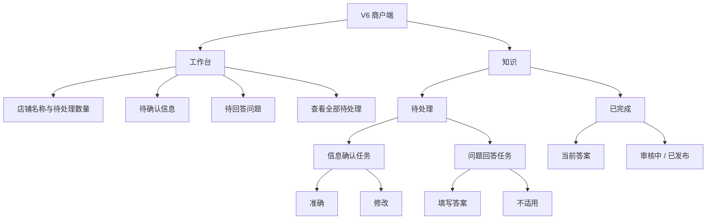
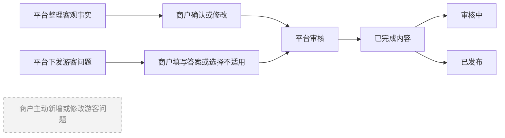

# V6 商户端界面规划图

## 一、整体信息架构



## 二、页面布局规划

```text
┌──────────────────────────┐
│ 工作台                   │
│ 龙乡小馆                 │
├──────────────────────────┤
│ 待处理 5 项              │
│                          │
│ 待确认信息               │
│ 营业时间是否准确？       │
│ [准确]          [修改]   │
│                          │
│ 待回答问题               │
│ 带小孩来方便吗？         │
│ [填写答案]      [不适用] │
│                          │
│       查看全部待处理     │
├──────────────────────────┤
│    工作台          知识  │
└──────────────────────────┘

┌──────────────────────────┐
│ 知识                     │
├──────────────────────────┤
│ [待处理]        [已完成] │
├──────────────────────────┤
│ 信息确认                 │
│ 地址：铜梁区……           │
│ [准确]          [修改]   │
│                          │
│ 问题回答                 │
│ 是否需要提前预约？       │
│ [填写答案]      [不适用] │
├──────────────────────────┤
│    工作台          知识  │
└──────────────────────────┘

┌──────────────────────────┐
│ 已完成                   │
├──────────────────────────┤
│ 营业时间                 │
│ 每日 10:00-21:00         │
│ 已发布                   │
│                          │
│ 带小孩来方便吗？         │
│ 提供儿童座椅，可提前联系 │
│ 审核中                   │
├──────────────────────────┤
│    工作台          知识  │
└──────────────────────────┘
```

## 三、受控内容流程



## 四、界面约束

- 一级导航只保留“工作台”和“知识”。
- 工作台只展示最优先的待处理内容，不展示推荐分数、商品、订单或经营报表。
- 商户不能新增、删除或修改游客问题。
- 商户退出未完成操作时，任务继续保留在待处理列表，不产生额外状态。
- 前台只展示“待处理、审核中、已发布”三种状态。
- 餐饮、住宿、景区、特产共用同一套页面和操作，不要求商户选择业态。
