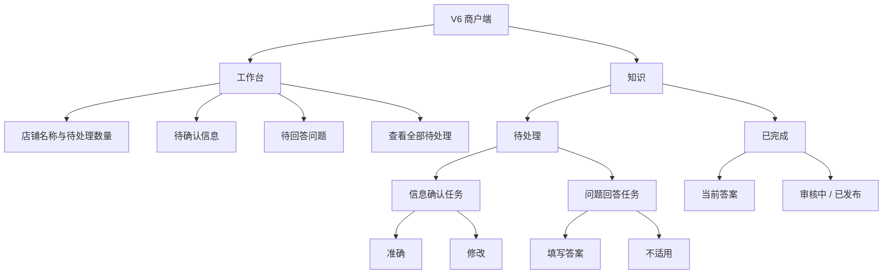

# V6 商户端界面规划图

> 继承基线：`V6商户端界面规划图-20260827-v1.md`。本版本只补充界面提示文案和操作反馈，不改变 V6 的页面结构、权限边界和状态定义。

## 一、整体信息架构



## 二、页面布局规划

```text
┌──────────────────────────┐
│ 工作台                   │
│ 龙乡小馆                 │
├──────────────────────────┤
│ 补充几条信息，让 AI 更懂你的店 │
│ 这些是游客常问、也能帮助经营的问题 │
│                          │
│ 待确认信息               │
│ 营业时间是否准确？       │
│ [准确]          [修改]   │
│                          │
│ 待回答问题               │
│ 带小孩来方便吗？         │
│ [填写答案]      [不适用] │
│                          │
│       查看全部待处理     │
├──────────────────────────┤
│    工作台          知识  │
└──────────────────────────┘
```

## 三、提示文案规划

### 1. 文案总原则

- 用“游客常问”“补充信息”“让 AI 更准确”替代“知识单元”“知识库治理”“推荐准备度”。
- 先说明内容来源和用途，再给操作按钮，降低商户对陌生信息的戒心。
- 只承诺“帮助 AI 更准确回答”和“了解游客关心什么”，不承诺曝光、排名或成交。
- 一次只引导一个动作，按钮文字直接表达结果：`准确`、`修改`、`填写答案`、`不适用`。
- 允许商户离开页面；未完成内容继续保留在“待处理”，不增加“暂不确定”等空置状态。

### 2. 工作台首屏

| 使用位置 | 推荐文案 | 目的 |
|---|---|---|
| 页面主标题下 | `补充几条信息，让 AI 更懂你的店` | 说明价值，避免平台术语 |
| 主标题下第二行 | `这些是游客常问、也能帮助经营的问题` | 解释为什么要处理 |
| 待确认模块标题 | `先确认店铺信息` | 降低第一步门槛 |
| 待确认模块辅助文案 | `平台已整理了一些信息，请你看一眼是否准确` | 说明平台先做了工作 |
| 待回答模块标题 | `再回答游客常问` | 形成自然的第二步 |
| 待回答模块辅助文案 | `回答后，AI 才能更准确地向游客介绍你的店` | 说明直接收益 |
| 待处理数量 | `还有 3 项信息需要你看一眼` | 用口语替代“任务数” |
| 全部完成时 | `目前没有需要处理的内容` | 清晰表达空状态 |
| 全部完成时辅助文案 | `有新的游客问题或信息需要更新时，我们会提醒你` | 说明后续机制 |

### 3. 信息确认页

| 使用位置 | 推荐文案 |
|---|---|
| 页面标题 | `确认店铺信息` |
| 页面说明 | `这些内容来自平台已整理的资料，请确认现在是否准确` |
| 来源说明 | `来源：公开资料 · 整理时间：2026-08-26` |
| 准确按钮 | `准确` |
| 修改按钮 | `修改` |
| 修改输入框提示 | `请填写现在的情况` |
| 修改输入框辅助文案 | `尽量填写明确的时间、地点或限制，方便 AI 正确回答` |
| 提交按钮 | `保存修改` |
| 修改成功提示 | `已保存，平台会先审核，再更新给游客` |
| 页面底部说明 | `只有审核通过的内容，才会用于回答游客问题` |

### 4. 游客问题回答页

| 使用位置 | 推荐文案 |
|---|---|
| 页面标题 | `回答游客问题` |
| 页面说明 | `这是游客实际关心的问题，回答得越具体，AI 越容易说准确` |
| 问题来源说明 | `根据游客近期提问整理` |
| 输入框提示 | `例如：提供儿童座椅，需要提前电话预留` |
| 输入框辅助文案 | `说清楚“有没有、什么时候、有什么限制”就可以` |
| 不适用按钮 | `不适用` |
| 不适用确认提示 | `确定这个问题不适用于你的店吗？` |
| 不适用确认按钮 | `确认不适用` |
| 提交按钮 | `提交回答` |
| 提交成功提示 | `已收到，平台审核后会更新 AI 的回答` |
| 空回答校验 | `请先填写一句话，或选择“不适用”` |

### 5. 已完成内容

| 使用位置 | 推荐文案 |
|---|---|
| 页签 | `已完成` |
| 信息状态 | `已发布` |
| 问题状态 | `审核中` / `已发布` |
| 审核中辅助文案 | `平台正在核对内容，暂时不会作为确定答案展示` |
| 已发布辅助文案 | `AI 可以据此回答游客问题` |
| 更新时间 | `最后更新：2026-08-27` |
| 无内容空状态 | `完成确认或回答后，内容会显示在这里` |

### 6. 系统反馈和异常

| 场景 | 推荐文案 |
|---|---|
| 网络失败 | `网络开小差了，内容还没有提交成功` |
| 重试按钮 | `重新提交` |
| 内容被退回 | `这条内容需要补充或修改，请按提示处理` |
| 内容冲突 | `平台资料与当前填写内容不一致，正在人工核对` |
| 审核通过 | `已审核通过，AI 将使用这条内容回答游客` |
| 审核未通过 | `这条内容暂未通过审核，请根据原因修改后再提交` |

## 四、推荐的首屏组合

```text
补充几条信息，让 AI 更懂你的店
这些是游客常问、也能帮助经营的问题

先确认店铺信息
平台已整理了一些信息，请你看一眼是否准确

营业时间：每天 10:00-21:00
来源：公开资料 · 整理于 8 月 26 日
[准确]                         [修改]

再回答游客常问
回答后，AI 才能更准确地向游客介绍你的店

带小孩来方便吗？
[填写答案]                     [不适用]
```

## 五、界面约束

- 一级导航只保留“工作台”和“知识”。
- 工作台只展示最优先的待处理内容，不展示推荐分数、商品、订单或经营报表。
- 商户不能新增、删除或修改游客问题。
- 商户退出未完成操作时，任务继续保留在待处理列表，不产生额外状态。
- 前台只展示“待处理、审核中、已发布”三种状态。
- 餐饮、住宿、景区、特产共用同一套页面和操作，不要求商户选择业态。
