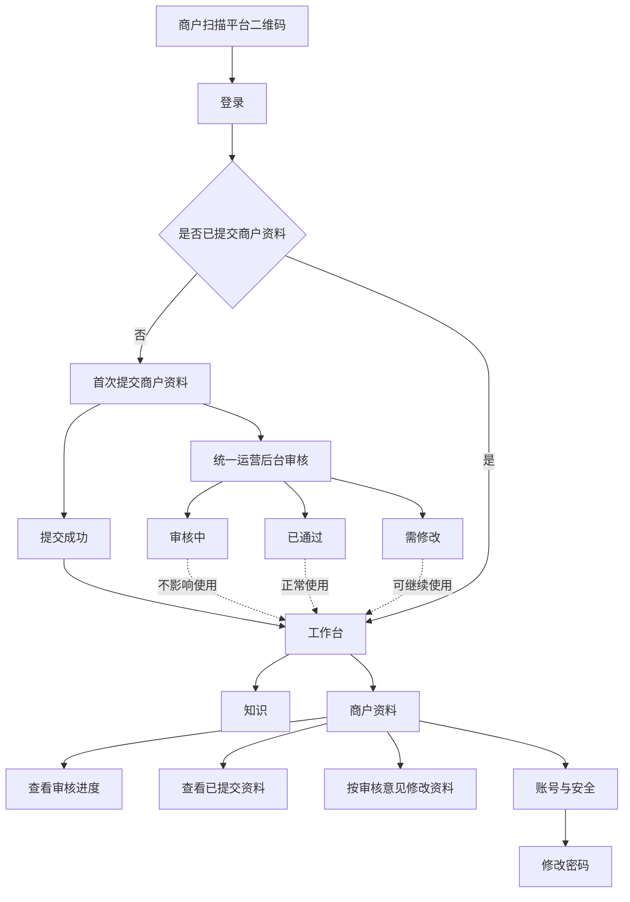
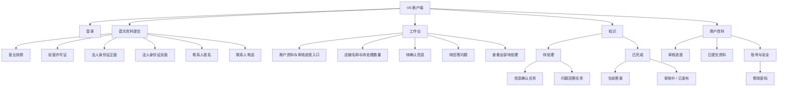

# V6 商户端界面规划图

> 继承基线：`V6商户端界面规划图-20260827-v2.md`。
>
> 本次确认变更：新增扫码后的手机号与默认密码登录、首次商户资料提交、统一运营后台审核、工作台商户资料入口、审核进度查看和修改密码页面。资料提交后即可进入工作台，审核进度不影响工作台与知识板块的使用权限。V2 已确认的知识板块结构、文案和权限边界继续沿用。

## 一、完整访问流程



### 访问规则

- 扫码只作为商户端入口，不单独增加扫码页面。
- 商户使用平台分配的手机号和默认密码登录。
- 首次登录必须提交商户资料，提交前不能进入工作台。
- 商户提交资料后立即进入工作台，无需等待审核通过。
- `审核中`、`已通过`、`需修改`均不影响工作台和知识板块权限。
- `需修改`时在工作台提醒商户补充资料，但不阻断其他操作。
- 后续修改密码不是首次登录的强制步骤，商户可从“商户资料—账号与安全”进入。

## 二、整体信息架构



## 三、新增页面规划

### 1. 登录页

```text
┌──────────────────────────┐
│ 铜梁旅游商户端           │
│ 登录后确认店铺信息，     │
│ 让 AI 更准确地介绍你的店 │
├──────────────────────────┤
│ 手机号                   │
│ [请输入平台登记的手机号] │
│                          │
│ 密码                     │
│ [请输入平台分配的密码]   │
│                          │
│ [登录]                   │
│                          │
│ 登录遇到问题？请联系平台 │
└──────────────────────────┘
```

交互要求：

- 手机号使用数字键盘，密码默认隐藏并提供显示/隐藏图标。
- 登录按钮仅在手机号和密码均已填写后可用。
- 登录失败不区分“手机号不存在”和“密码错误”，统一提示，避免泄露账号是否存在。
- 不在登录页展示商品、订单、营销等旧版能力。

推荐文案：

| 使用位置 | 推荐文案 |
|---|---|
| 页面标题 | `铜梁旅游商户端` |
| 页面说明 | `登录后确认店铺信息，让 AI 更准确地介绍你的店` |
| 手机号提示 | `请输入平台登记的手机号` |
| 密码提示 | `请输入平台分配的密码` |
| 登录按钮 | `登录` |
| 登录失败 | `手机号或密码不正确，请重新输入` |
| 账号帮助 | `登录遇到问题？请联系平台` |

### 2. 首次商户资料提交页

采用一个可滚动页面，不拆成多步，避免商户在多个页面之间来回切换。页面按“经营资料—法人资料—联系人”分组，底部固定提交按钮。

```text
┌──────────────────────────┐
│ 提交商户资料             │
│ 用于确认商户身份和经营资质 │
├──────────────────────────┤
│ 经营资料                 │
│ 营业执照        [上传照片]│
│ 经营许可证      [上传照片]│
│                          │
│ 法人资料                 │
│ 身份证正面      [上传照片]│
│ 身份证反面      [上传照片]│
│                          │
│ 联系人                   │
│ 姓名  [请输入联系人姓名] │
│ 电话  [请输入联系人电话] │
│                          │
│ 资料仅用于商户身份审核   │
├──────────────────────────┤
│ [提交资料并进入工作台]   │
└──────────────────────────┘
```

上传要求：

- 营业执照、经营许可证、法人身份证正面和反面均为必传照片。
- 每个上传位支持拍照或从相册选择，上传后展示缩略图和`重新上传`。
- 上传前提示保持证件完整、文字清楚、避免反光和遮挡。
- 联系人姓名和电话必填，电话号码使用数字键盘。
- 所有字段完成后才允许提交。
- 提交过程中按钮显示`正在提交…`并防止重复点击。
- 法人证件照片在商户端后续查看时默认缩略和脱敏；统一运营后台按权限查看原图。

推荐文案：

| 使用位置 | 推荐文案 |
|---|---|
| 页面标题 | `提交商户资料` |
| 页面说明 | `用于确认商户身份和经营资质` |
| 上传提示 | `请上传完整、清晰、无遮挡的照片` |
| 隐私说明 | `资料仅用于商户身份审核，平台将妥善保护` |
| 提交按钮 | `提交资料并进入工作台` |
| 缺少照片 | `请先上传全部证件照片` |
| 缺少联系人 | `请填写联系人姓名和电话` |
| 电话格式错误 | `请输入正确的联系人电话` |
| 上传失败 | `照片上传失败，请重新上传` |

### 3. 提交成功页

```text
┌──────────────────────────┐
│            ✓             │
│ 资料已提交               │
│ 平台将尽快完成审核       │
│                          │
│ 审核期间可以正常使用     │
│ 工作台和知识功能         │
│                          │
│ [进入工作台]             │
└──────────────────────────┘
```

推荐文案：

- 主文案：`资料已提交`
- 辅助文案：`平台将尽快完成审核`
- 权限说明：`审核期间可以正常使用工作台和知识功能`
- 主按钮：`进入工作台`

### 4. 工作台商户资料入口

入口固定在工作台顶部、店铺名称下方，始终可见。它只显示当前审核状态和查看动作，不占用知识任务的主要空间。

```text
┌──────────────────────────┐
│ 工作台                   │
│ 龙乡小馆                 │
│ 商户资料：审核中       › │
│ 审核期间可正常使用       │
├──────────────────────────┤
│ 补充几条信息，让 AI 更懂你的店 │
│ ……                       │
├──────────────────────────┤
│    工作台          知识  │
└──────────────────────────┘
```

不同审核状态的入口文案：

| 审核状态 | 主文案 | 辅助文案 |
|---|---|---|
| 审核中 | `商户资料：审核中` | `审核期间可正常使用` |
| 已通过 | `商户资料：已通过` | `查看已提交资料` |
| 需修改 | `商户资料：需修改` | `请根据审核意见补充，不影响其他功能` |

### 5. 商户资料与审核进度页

```text
┌──────────────────────────┐
│ ‹ 商户资料               │
├──────────────────────────┤
│ 审核进度                 │
│ ● 资料已提交             │
│ ● 平台审核中             │
│ ○ 审核结果               │
│                          │
│ 审核期间可正常使用工作台 │
├──────────────────────────┤
│ 已提交资料               │
│ 营业执照          已上传 ›│
│ 经营许可证        已上传 ›│
│ 法人身份证        已上传 ›│
│ 联系人            陈小满 ›│
├──────────────────────────┤
│ 账号与安全               │
│ 修改密码               › │
└──────────────────────────┘
```

审核状态规划：

| 状态 | 页面提示 | 可执行动作 |
|---|---|---|
| 审核中 | `平台正在审核资料，期间可正常使用工作台和知识功能` | 查看资料、修改密码 |
| 已通过 | `商户资料已通过审核` | 查看资料、修改密码 |
| 需修改 | `部分资料需要修改，不影响其他功能使用` | 查看审核意见、重新上传并提交 |

资料展示规则：

- 营业执照和经营许可证显示缩略图及上传状态。
- 法人身份证只显示`已上传`和打码缩略图，不直接展示完整证件号码。
- 联系人电话默认脱敏，例如`138****1234`。
- `需修改`时只开放被退回资料的重新上传入口，其他已通过资料保持只读。
- 重新提交后状态恢复为`审核中`，仍不影响工作台和知识功能。

### 6. 修改密码页

```text
┌──────────────────────────┐
│ ‹ 修改密码               │
├──────────────────────────┤
│ 当前密码                 │
│ [请输入当前密码]         │
│                          │
│ 新密码                   │
│ [请输入新密码]           │
│                          │
│ 确认新密码               │
│ [请再次输入新密码]       │
│                          │
│ [确认修改]               │
└──────────────────────────┘
```

推荐文案：

| 场景 | 推荐文案 |
|---|---|
| 新密码不一致 | `两次输入的新密码不一致` |
| 当前密码错误 | `当前密码不正确，请重新输入` |
| 修改成功 | `密码已修改，下次请使用新密码登录` |
| 网络失败 | `密码还没有修改成功，请重新提交` |

## 四、工作台与知识页面规划

### 1. 工作台

```text
┌──────────────────────────┐
│ 工作台                   │
│ 龙乡小馆                 │
│ 商户资料：审核中       › │
│ 审核期间可正常使用       │
├──────────────────────────┤
│ 补充几条信息，让 AI 更懂你的店 │
│ 这些是游客常问、也能帮助经营的问题 │
│                          │
│ 待确认信息               │
│ 营业时间是否准确？       │
│ [准确]          [修改]   │
│                          │
│ 待回答问题               │
│ 带小孩来方便吗？         │
│ [填写答案]      [不适用] │
│                          │
│       查看全部待处理     │
├──────────────────────────┤
│    工作台          知识  │
└──────────────────────────┘
```

### 2. 知识

```text
┌──────────────────────────┐
│ 知识                     │
├──────────────────────────┤
│ [待处理]        [已完成] │
├──────────────────────────┤
│ 信息确认                 │
│ 地址：铜梁区……           │
│ [准确]          [修改]   │
│                          │
│ 问题回答                 │
│ 是否需要提前预约？       │
│ [填写答案]      [不适用] │
├──────────────────────────┤
│    工作台          知识  │
└──────────────────────────┘
```

### 3. 已完成内容

```text
┌──────────────────────────┐
│ 已完成                   │
├──────────────────────────┤
│ 营业时间                 │
│ 每日 10:00-21:00         │
│ 已发布                   │
│                          │
│ 带小孩来方便吗？         │
│ 提供儿童座椅，可提前联系 │
│ 审核中                   │
├──────────────────────────┤
│    工作台          知识  │
└──────────────────────────┘
```

## 五、知识相关提示文案

### 1. 文案总原则

- 用“游客常问”“补充信息”“让 AI 更准确”替代“知识单元”“知识库治理”“推荐准备度”。
- 先说明内容来源和用途，再给操作按钮，降低商户对陌生信息的戒心。
- 只承诺“帮助 AI 更准确回答”和“了解游客关心什么”，不承诺曝光、排名或成交。
- 一次只引导一个动作，按钮文字直接表达结果：`准确`、`修改`、`填写答案`、`不适用`。
- 允许商户离开页面；未完成内容继续保留在“待处理”，不增加“暂不确定”等空置状态。

### 2. 工作台首屏

| 使用位置 | 推荐文案 | 目的 |
|---|---|---|
| 页面主标题下 | `补充几条信息，让 AI 更懂你的店` | 说明价值，避免平台术语 |
| 主标题下第二行 | `这些是游客常问、也能帮助经营的问题` | 解释为什么要处理 |
| 待确认模块标题 | `先确认店铺信息` | 降低第一步门槛 |
| 待确认模块辅助文案 | `平台已整理了一些信息，请你看一眼是否准确` | 说明平台先做了工作 |
| 待回答模块标题 | `再回答游客常问` | 形成自然的第二步 |
| 待回答模块辅助文案 | `回答后，AI 才能更准确地向游客介绍你的店` | 说明直接收益 |
| 待处理数量 | `还有 3 项信息需要你看一眼` | 用口语替代“任务数” |
| 全部完成时 | `目前没有需要处理的内容` | 清晰表达空状态 |
| 全部完成时辅助文案 | `有新的游客问题或信息需要更新时，我们会提醒你` | 说明后续机制 |

### 3. 信息确认页

| 使用位置 | 推荐文案 |
|---|---|
| 页面标题 | `确认店铺信息` |
| 页面说明 | `这些内容来自平台已整理的资料，请确认现在是否准确` |
| 来源说明 | `来源：公开资料 · 整理时间：2026-08-26` |
| 准确按钮 | `准确` |
| 修改按钮 | `修改` |
| 修改输入框提示 | `请填写现在的情况` |
| 修改输入框辅助文案 | `尽量填写明确的时间、地点或限制，方便 AI 正确回答` |
| 提交按钮 | `保存修改` |
| 修改成功提示 | `已保存，平台会先审核，再更新给游客` |
| 页面底部说明 | `只有审核通过的内容，才会用于回答游客问题` |

### 4. 游客问题回答页

| 使用位置 | 推荐文案 |
|---|---|
| 页面标题 | `回答游客问题` |
| 页面说明 | `这是游客实际关心的问题，回答得越具体，AI 越容易说准确` |
| 问题来源说明 | `根据游客近期提问整理` |
| 输入框提示 | `例如：提供儿童座椅，需要提前电话预留` |
| 输入框辅助文案 | `说清楚“有没有、什么时候、有什么限制”就可以` |
| 不适用按钮 | `不适用` |
| 不适用确认提示 | `确定这个问题不适用于你的店吗？` |
| 不适用确认按钮 | `确认不适用` |
| 提交按钮 | `提交回答` |
| 提交成功提示 | `已收到，平台审核后会更新 AI 的回答` |
| 空回答校验 | `请先填写一句话，或选择“不适用”` |

### 5. 已完成内容

| 使用位置 | 推荐文案 |
|---|---|
| 页签 | `已完成` |
| 信息状态 | `已发布` |
| 问题状态 | `审核中` / `已发布` |
| 审核中辅助文案 | `平台正在核对内容，暂时不会作为确定答案展示` |
| 已发布辅助文案 | `AI 可以据此回答游客问题` |
| 更新时间 | `最后更新：2026-08-27` |
| 无内容空状态 | `完成确认或回答后，内容会显示在这里` |

### 6. 系统反馈和异常

| 场景 | 推荐文案 |
|---|---|
| 网络失败 | `网络开小差了，内容还没有提交成功` |
| 重试按钮 | `重新提交` |
| 内容被退回 | `这条内容需要补充或修改，请按提示处理` |
| 内容冲突 | `平台资料与当前填写内容不一致，正在人工核对` |
| 审核通过 | `已审核通过，AI 将使用这条内容回答游客` |
| 审核未通过 | `这条内容暂未通过审核，请根据原因修改后再提交` |

## 六、关键权限与状态

| 场景 | 是否可进入工作台 | 是否可使用知识 | 是否可查看商户资料 |
|---|---:|---:|---:|
| 首次登录、资料未提交 | 否 | 否 | 仅可填写并提交 |
| 资料审核中 | 是 | 是 | 是 |
| 资料已通过 | 是 | 是 | 是 |
| 资料需修改 | 是 | 是 | 是，可按意见修改 |

## 七、界面约束

- 一级导航只保留“工作台”和“知识”，不新增“我的”页签。
- 商户资料入口固定放在工作台顶部；修改密码从商户资料页进入。
- 工作台只展示最优先的待处理内容，不展示推荐分数、商品、订单或经营报表。
- 商户不能新增、删除或修改游客问题。
- 商户退出未完成操作时，任务继续保留在待处理列表，不产生额外状态。
- 知识内容只展示“待处理、审核中、已发布”三种状态。
- 商户资料审核只展示“审核中、已通过、需修改”三种状态。
- 餐饮、住宿、景区、特产共用同一套页面和操作，不要求商户选择业态。
- 敏感证件和联系人信息在商户端默认脱敏展示，完整资料仅由有权限的统一运营后台人员查看。
