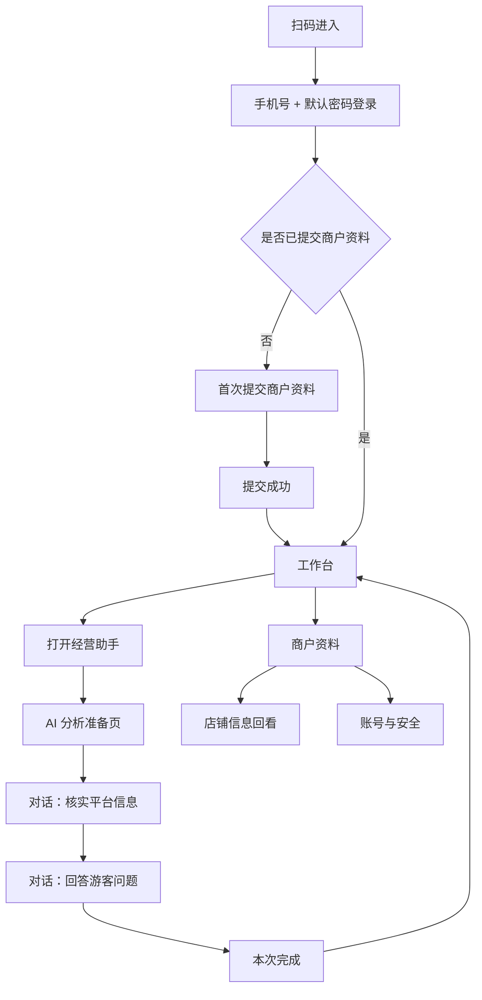

# V6 商户端界面规划图

> 继承基线：`V6商户端界面规划图-20260827-v3.md`。
>
> 本次确认变更：商户端不再以“知识”作为管理对象，也不展示“待处理 / 已完成”状态。商户端只围绕一个核心入口“经营助手”工作：平台先从知识库中整理需要商户核实的信息和游客关心的问题，再通过 AI 对话引导商户逐项确认或回答。商户不能主动新增、删除或改写游客问题。

## 一、设计结论

### 1. 商户端的两项业务动作

1. **核实平台整理的信息**：例如营业时间、到店地址、停车方式等。商户选择`准确`或`修改`。
2. **回答平台下发的问题**：例如亲子接待、预约方式等。商户填写答案或选择`不适用`。

这两项动作是产品能力，不在界面上拆成两个管理模块。界面统一表现为一次“经营助手”对话。

### 2. 一级入口

- 一级主入口保留`工作台`。
- 工作台只放一个主要动作：`打开经营助手`。
- 不再保留独立的`知识`底部导航、知识状态页签、待处理数量和已完成列表。
- `商户资料`仍从工作台顶部进入；账号与安全仍从商户资料页进入。

### 3. 对话边界

- AI 只能展示平台预先下发的核实项和问题，不能把对话变成开放式聊天。
- 每次只呈现一个当前问题，降低低频用户的阅读和决策负担。
- 商户提交后，AI 立即给出下一项，不要求商户理解“知识单元”或“知识库”。
- 对话结束后只提供本次完成摘要，不提供状态管理页。

## 二、整体访问流程



### 访问规则

- 首次登录仍必须提交营业执照、经营许可证、法人身份证正反面、联系人姓名和电话。
- 资料提交后立即进入工作台，审核状态不影响经营助手使用。
- 经营助手的问题由统一运营后台和知识库共同提供；商户不能自行新增问题。
- 没有新问题时，工作台显示“目前没有需要核对的内容”，不显示空的状态标签。

## 三、页面清单与路由

| 页面 | 路由文件 | 页面职责 | 进入方式 |
| --- | --- | --- | --- |
| 工作台 | `workbench.html` | 展示店铺身份和经营助手入口 | 登录成功后默认进入 |
| 经营助手准备 | `assistant-start.html` | 说明本次要核对的内容、预计时间，触发 AI 分析 | 点击`打开经营助手` |
| 经营助手对话 | `assistant.html` | 连续完成信息核实和问题回答 | 准备页点击`开始核对` |
| 本次完成 | `assistant-complete.html` | 告知本次已提交内容和后续机制 | 对话全部完成后进入 |
| 店铺信息 | `store-information.html` | 只读回看已确认或已回答的内容 | 商户资料页点击`店铺信息` |
| 商户资料 | `merchant-profile.html` | 查看资料与审核进度 | 工作台顶部点击`商户资料` |
| 资料修改 | `merchant-profile-correction.html` | 按审核意见重新提交资料 | 商户资料页在需修改时进入 |
| 修改密码 | `change-password.html` | 修改登录密码 | 商户资料页点击`修改密码` |

`assistant.html`不拆成“信息确认页”和“问题回答页”两个入口。页面内部根据当前对话步骤展示不同的消息和操作区，保证商户感知到的是一次连续沟通。

## 四、页面一：工作台

### 页面目标

让商户一眼知道“现在要做什么”，并在一次点击后进入经营助手。

### 页面结构

```text
┌──────────────────────────┐
│ 15:30                    │
│ [店铺图标] 龙乡小馆  商户资料 │
│                          │
│ 经营助手                 │
│ 帮你核实店铺信息，回答游客常问的问题 │
│                          │
│ ┌──────────────────────┐ │
│ │ 有内容需要和你核对    │ │
│ │ 平台整理了店铺信息和游客问题 │ │
│ │ 预计 3 分钟完成        │ │
│ │ [打开经营助手]         │ │
│ └──────────────────────┘ │
│                          │
│ 最近一次核对：8月27日     │
│                          │
│                 工作台   │
└──────────────────────────┘
```

### 页面元素

| 元素 | 规则与文案 |
| --- | --- |
| 店铺身份 | 显示店铺名称；右侧为`商户资料`文字入口，不再显示单独的审核状态入口。 |
| 主标题 | `经营助手` |
| 价值说明 | `帮你核实店铺信息，回答游客常问的问题` |
| 引导说明 | `平台整理了一些内容，和你一起核对一下` |
| 时间说明 | `预计 3 分钟完成`，按当前待处理项数量估算。 |
| 主按钮 | `打开经营助手` |
| 最近记录 | 只显示最近一次完成日期，不展示历史状态列表。 |
| 无新内容 | `目前没有需要核对的内容`；辅助文案为`有新的店铺信息或游客问题时，经营助手会提醒你`。 |

### 工作台禁止出现

- `待确认 2 / 待回答 3 / 已完成 4`等统计数字。
- `待处理 / 已完成`页签。
- 商品、订单、营业额、经营分析、知识准备度。
- “知识库”“知识单元”“治理”等平台术语。

## 五、页面二：经营助手准备页

### 页面目标

让商户知道为什么要做、需要多久，减少点击后的不确定感。

### 页面结构

```text
┌──────────────────────────┐
│ ‹ 经营助手               │
│                          │
│ 我来帮你看一遍店铺信息    │
│                          │
│ 这次会一起确认：          │
│ · 平台整理的店铺信息      │
│ · 游客最近常问的问题      │
│                          │
│ 你只需要告诉我现在的情况   │
│ 大约需要 3 分钟            │
│                          │
│ [开始核对]               │
└──────────────────────────┘
```

### 交互

- 点击`开始核对`后显示短暂的加载文案：`正在整理需要和你核对的内容……`。
- 加载只作为过渡，不展示技术日志、分析分数或复杂进度条。
- 无内容时直接进入完成态，不让商户面对空白列表。
- 返回工作台时不丢失已经提交的本次结果。

## 六、页面三：经营助手对话页

### 页面目标

用一问一答的方式完成全部商户动作。AI 提问，商户做选择或填写答案。

### 统一页面布局

```text
┌──────────────────────────┐
│ ‹ 经营助手        2 / 5  │
│                          │
│ 经营助手                 │
│ 我们先核对店铺信息        │
│                          │
│ ┌──────────────────────┐ │
│ │ 平台资料显示：        │ │
│ │ 每天 10:00—21:00      │ │
│ │ 现在还是这样吗？       │ │
│ └──────────────────────┘ │
│                          │
│ [准确]       [需要修改]  │
│                          │
│ 你的回答会先经过平台审核  │
└──────────────────────────┘
```

### A. 信息核实步骤

AI 消息模板：

```text
平台资料显示：
每天 10:00—21:00

现在还是这样吗？
```

操作：

- `准确`：记录当前事实，追加商户消息`准确`，进入下一项。
- `需要修改`：展开一个单项输入区，按钮改为`保存修改`。
- 修改输入框提示：`请告诉我现在的营业时间`。
- 修改辅助文案：`尽量写清楚每天的时间，以及节假日是否有变化`。
- 保存后追加消息`我记下了：……`，并提示`平台审核后会更新给游客`。

信息核实不得要求商户填写平台已经知道且未发生变化的内容。

### B. 游客问题步骤

AI 消息模板：

```text
游客经常会问：
“带小孩来方便吗？”

你可以告诉我有没有儿童座椅、
婴儿车放置空间或其他注意事项。
```

操作：

- 输入框提示：`例如：有儿童座椅，数量不多，建议提前电话预留`。
- 辅助文案：`说清楚“有没有、什么时候、有什么限制”就可以`。
- 主按钮：`提交回答`。
- 次按钮：`不适用`。
- 选择`不适用`前弹出确认：`确定这个问题不适用于你的店吗？`。
- 提交后追加商户回答，并提示`平台审核后会更新 AI 的回答`。

### 对话行为规则

- 一次只出现一个未完成问题；已回答内容缩成较轻的历史消息，不再显示操作按钮。
- 不提供自由新增问题、删除问题、修改平台问题的入口。
- 商户中途退出时，已提交的回答保留；下次从第一条未完成内容继续。
- 网络失败时保留输入内容，提示`网络开小差了，内容还没有提交成功`，提供`重新提交`。
- 防止重复提交：提交后按钮进入短暂禁用态，成功后自动进入下一问。

## 七、页面四：本次完成

### 页面目标

给出明确的结束感，不引导商户继续管理状态。

### 页面结构

```text
┌──────────────────────────┐
│                          │
│          ✓               │
│ 这次核对完成了            │
│                          │
│ 你确认了 2 条店铺信息     │
│ 回答了 3 个游客问题       │
│                          │
│ 平台审核后，AI 会用更新后的内容回答游客 │
│                          │
│ [回到工作台]             │
│ [看看店铺信息]           │
└──────────────────────────┘
```

### 文案规则

- 不使用“已完成状态”“任务完成率”“知识贡献值”等概念。
- 审核中的内容只用一句话说明：`平台审核后，AI 会用更新后的内容回答游客`。
- `看看店铺信息`进入只读回看页，不进入状态管理页。

## 八、页面五：店铺信息回看

### 页面目标

解决商户“我之前回答了什么、平台现在怎么记录”的信任问题，同时不让商户承担知识管理工作。

### 页面结构

```text
┌──────────────────────────┐
│ ‹ 店铺信息               │
│                          │
│ 营业时间                 │
│ 每天 10:00—21:00         │
│ 最近核对：8月27日         │
│                          │
│ 游客常问                 │
│ 带小孩来方便吗？          │
│ 有儿童座椅，建议提前预留   │
│ 平台审核中               │
│                          │
│ 这些内容由平台整理并审核， │
│ 如情况变化，请从经营助手重新核对 │
└──────────────────────────┘
```

### 回看规则

- 只读，不提供直接编辑输入框。
- 内容发生变化时，商户回到经营助手处理新的核实项。
- 可显示`平台审核中`、`已用于回答游客`等轻量辅助文案，但不提供筛选页签。
- 法人证件、联系人电话仍遵循商户资料页的脱敏规则，不与店铺信息混在一起。

## 九、商户资料与账号安全

沿用 V3 已确认的登录、首次资料提交、审核进度、资料退回修改和修改密码页面。只做以下入口调整：

- 工作台顶部保留`商户资料`，与店铺名称同行靠右。
- 经营助手完成页的`看看店铺信息`只进入店铺信息，不替代商户资料。
- 商户资料页增加`店铺信息`只读入口，避免在主导航增加页面。
- 去除工作台顶部任何重复的`审核中`入口；审核状态仅在商户资料页查看。

## 十、视觉和交互规范

- 继续沿用 V5：无手机边框、375px 逻辑画布、30px 状态栏、浅灰绿色背景、深绿色主色、白色圆角内容区域。
- 经营助手页面采用连续消息和单项操作区，不使用传统后台表格、双栏卡片或复杂数据看板。
- 主按钮固定在当前对话内容下方，触控热区不小于 44×44px。
- 使用短句、口语和具体例子；避免“知识单元、审核队列、准备度”等术语。
- 任何审核状态都不阻断商户进入工作台或继续处理经营助手。
- 不使用颜色单独表达状态，文字必须明确说明“平台审核中”或“已用于回答游客”。

## 十一、关键验收标准

1. 工作台首屏只有一个核心动作：`打开经营助手`。
2. 页面不出现`待处理 / 已完成`页签、知识数量统计或商品订单入口。
3. 经营助手能依次处理信息核实和游客问题回答，不要求商户切换模块。
4. 每次只展示一个当前问题；提交后自动进入下一项。
5. 商户只能选择准确、修改、填写回答或不适用，不能新增游客问题。
6. 中途退出后已提交内容保留，下次从未完成项继续。
7. 完成页有明确结束反馈，但不引导管理状态。
8. 店铺信息支持只读回看，内容变化必须回到经营助手处理。
9. 商户资料审核状态只在商户资料页查看，不在工作台重复展示。
10. 所有页面继续符合 V5 的无手机边框视觉规范。
